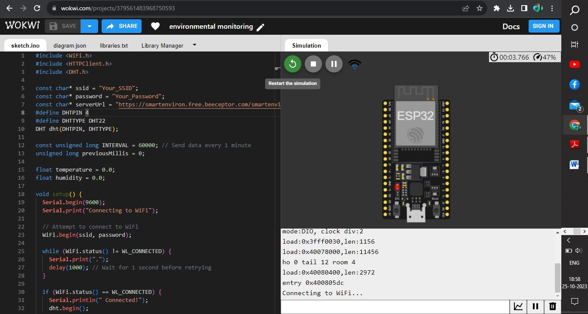
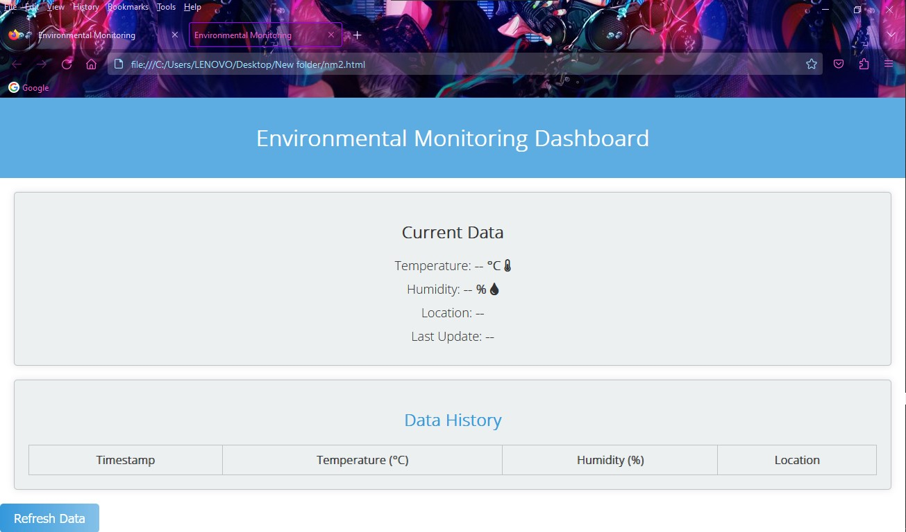

# Environmental-Monitoring

# IoT Project: Environmental Monitoring

## Abstract Idea

The field of environmental monitoring has become increasingly critical in the face of escalating climate change and resource depletion. Leveraging the capabilities of the Internet of Things (IoT) offers a promising solution to address environmental challenges effectively.

## Understanding of the Problem

The problem in IoT-based environmental monitoring is the lack of real-time data, connectivity in remote areas, data analysis capabilities, and tools for sustainability planning. Addressing these issues is crucial for effective environmental monitoring, decision-making, and regulatory compliance while involving and educating communities.

## Problem Definition

The problem at hand revolves around the urgent need to monitor, manage, and mitigate environmental issues such as air and water pollution, deforestation, wildlife conservation, and climate change. Traditional methods of data collection and management are often inadequate, expensive, and inefficient. This leads to delayed responses to environmental crises, hindering sustainability efforts.

## Design Thinking Approach

To tackle these challenges, a design thinking approach can be adopted. This involves empathizing with stakeholders, defining the problem, ideating solutions, prototyping, and testing. In the context of IoT-based environmental monitoring:

1. **Empathize:**
   - Understand the needs and concerns of environmental organizations, regulatory bodies, scientists, and communities affected by environmental issues. Identify their pain points and requirements for data and information.

2. **Define:**
   - Clearly articulate the problems, such as insufficient real-time environmental data, limited connectivity in remote areas, and the lack of actionable insights. Prioritize these problems based on impact and feasibility.

3. **Ideate:**
   - Generate creative ideas for IoT solutions, including sensor networks, data analytics, and communication technologies. Consider how these solutions can enhance data collection, improve decision-making, and promote sustainability.

4. **Prototype:**
   - Develop prototypes or proof-of-concept systems that demonstrate the feasibility of IoT solutions. Test these prototypes in real-world scenarios to refine their functionality and reliability.

5. **Test:**
   - Gather feedback from users, environmental experts, and stakeholders to refine the prototypes further. Ensure that the solutions align with the identified problems and address the specific needs of the environmental monitoring context.


# Phase 2: Innovation - Transforming Design into Reality

## Introduction

The Innovation phase is the pivotal step in converting our design thinking ideas into a tangible IoT-based environmental management solution. This document outlines the comprehensive steps that will be taken to bring our design concept into practice.

## Step 1: Refine Problem Definition

- **Review Problem Statement:**
  - Revisit the problem statement to ensure clarity and relevance.
- **Gather Additional Insights:**
  - Consult with stakeholders, environmental experts, and target communities to gather more insights.

## Step 2: Define Technical Requirements

- **Sensor Selection:**
  - Determine the types of sensors required for data collection (e.g., air quality, water quality, temperature, humidity, etc.).
- **Data Storage:**
  - Decide on the data storage solutions (local or cloud-based databases) and data management tools.
- **Communication Protocols:**
  - Choose the appropriate communication protocols for data transmission (e.g., LoRa, NB-IoT, or cellular networks).
- **Data Analysis Tools:**
  - Identify the data analysis tools and algorithms to be used for deriving actionable insights.

## Step 3: Develop Hardware and Software

**Hardware Development:**

- Identify IoT hardware components (sensors, microcontrollers, communication modules).
- Create a detailed hardware architecture diagram.
- Source the required hardware components.
- Assemble and test the hardware components.

**Software Development:**

- Develop firmware for microcontrollers to collect and transmit data.
- Develop server-side software for data reception, storage, and analysis.
- Create a user interface (UI) for data visualization and user interaction.
- Ensure data security and privacy measures are implemented.

## Step 4: Prototyping

- **Create Prototypes:**
  - Build a prototype system with a limited set of sensors.
  - Test the prototype in controlled environments.
  - Refine the hardware and software based on initial testing.

## Step 5: Real-world Testing

- **Deploy Prototypes in Real Environments:**
  - Install prototypes in target environmental monitoring locations.
  - Monitor and collect real-time data over an extended period.
  - Address technical issues and refine the system based on field testing results.

## Step 6: User Feedback

- **Gather User Feedback:**
  - Engage with stakeholders and user groups for feedback.
  - Identify areas for improvement and additional features.
  - Iteratively refine the system based on feedback.

## Step 7: Data Analysis and Insights

- **Data Analysis:**
  - Use collected data to analyze environmental conditions and trends.
  - Apply machine learning and AI algorithms for predictive analysis.
  - Generate actionable insights and reports for decision-makers.

## Step 8: Sustainability and Community Engagement

- **Community Involvement:**
  - Implement community engagement programs, educational initiatives, and awareness campaigns.
  - Enable community members to access and interpret environmental data.
  - Promote sustainable practices based on insights.

## Step 9: Regulatory Compliance

- **Ensure Regulatory Compliance:**
  - Implement features to facilitate compliance reporting.
  - Collaborate with regulatory bodies to ensure data accuracy and alignment with regulations.

## Step 10: Documentation and Reporting

- **Document the Entire Process:**
  - Create detailed documentation for hardware and software components.
  - Prepare reports on field testing, user feedback, and data analysis.
  - Share findings and progress with stakeholders and project sponsors.

## Conclusion

The Innovation phase is a crucial step in turning our design thinking concept into a practical solution for IoT-based environmental management. By following these structured steps, we aim to address environmental challenges effectively and make a positive impact on sustainability efforts.


# IOT-PHASE 3
## Development Part 1

### CODE:

```cpp
#include <WiFi.h>
#include <HTTPClient.h>
#include <DHT.h>
const char* ssid = "Your_SSID";
const char* password = "Your_Password";
const char* serverUrl = "https://smartenviron.free.beeceptor.com/smartenviron/";
#define DHTPIN 4
#define DHTTYPE DHT22
DHT dht(DHTPIN, DHTTYPE);
const unsigned long INTERVAL = 60000; // Send data every 1 minute
unsigned long previousMillis = 0;
float temperature = 0.0;
float humidity = 0.0;
void setup() {
  Serial.begin(9600);
  Serial.print("Connecting to WiFi");
  // Attempt to connect to WiFi
  WiFi.begin(ssid, password);
  while (WiFi.status() != WL_CONNECTED) {
    Serial.print(".");
    delay(1000); // Wait for 1 second before retrying
  }
  if (WiFi.status() == WL_CONNECTED) {
    Serial.println(" Connected!");
    dht.begin();
  } else {
    Serial.println(" WiFi not connected.");
  }
}

void loop() {
  if (WiFi.status() != WL_CONNECTED) {
    // WiFi is not connected, you can handle this scenario as needed
    Serial.println("WiFi not connected. Reconnecting...");
    connectToWiFi();
  } else {
    unsigned long currentMillis = millis();
    if (currentMillis - previousMillis >= INTERVAL) {
      previousMillis = currentMillis;
      float newTemperature = dht.readTemperature();
      float newHumidity = dht.readHumidity();
      if (!isnan(newTemperature) && !isnan(newHumidity)) {
        // Only send data if there's a significant change
        if (abs(newTemperature - temperature) >= 0.5 || abs(newHumidity - humidity) >= 1.0) {
          temperature = newTemperature;
          humidity = newHumidity;
          sendSensorData();
        }
      } else {
        Serial.println("Failed to read from DHT sensor!");
      }
    }
  }
}

void connectToWiFi() {
  WiFi.begin(ssid, password);
  while (WiFi.status() != WL_CONNECTED) {
    Serial.print(".");
    delay(1000); // Wait for 1 second before retrying
  }
  if (WiFi.status() == WL_CONNECTED) {
    Serial.println("WiFi reconnected!");
  }
}

void sendSensorData() {
  // The rest of your sendSensorData function remains the same
}
```

### OUTPUT:


### CODE DESCRIPTION:

This Arduino sketch is designed to create a robust environment monitoring system. It utilizes a DHT22 sensor to capture temperature and humidity data and wirelessly transmits this data to a designated server via Wi-Fi. The core functionalities encompass Wi-Fi network connectivity, sensor data acquisition, and periodic data transmission.

#### Initialization and Wi-Fi Connection:

The sketch starts by initializing the Serial communication for debugging purposes with a baud rate of 9600. It then attempts to connect to a Wi-Fi network using the provided SSID (Service Set Identifier) and password. During the connection process, the sketch displays a series of dots to indicate the connection status. If a connection is established, it informs the user with a "Connected!" message. If not, it signals that Wi-Fi is not connected.

#### Main Loop:

The primary loop continually checks the Wi-Fi connection status. If the connection is lost, it enters a reconnection phase, calling the `connectToWiFi()` function. When the Wi-Fi connection is stable, the sketch monitors the time elapsed since the last data transmission. It waits for a specified interval (in this case, one minute) before checking the sensor for new temperature and humidity readings. If fresh data is available and is significantly different from the previous readings (with predefined thresholds of 0.5°C for temperature and 1.0% for humidity), it proceeds to send the updated data to the server.

#### Wi-Fi Reconnection Function (`connectToWiFi`):

This function is responsible for reconnecting to the Wi-Fi network in case of a connection loss. It employs a loop to repeatedly attempt connection and displays progress dots. When a successful reconnection occurs, it prints "WiFi reconnected."

#### Data Transmission Function (`sendSensorData`):

This function constructs a URL to the designated server, incorporating the temperature and humidity data as query parameters. It initiates an HTTP GET request to the server using the HTTPClient library. The function then evaluates the HTTP response code to confirm the success of the transmission. In the event of success, it prints the server's response. If the HTTP request fails, it reports an error code.

### ADDITIONAL FEATURES:

- Error Handling: Improve error handling to handle network or server issues gracefully.
- Modularize Code: Break the code into smaller functions for better organization and readability.
- Minimize String Usage: Avoid using the String class, as it can cause memory fragmentation on microcontrollers. Use character arrays (char[]) for data instead.
- Reduce HTTP Requests: Instead of sending data in every loop iteration, consider sending data at longer intervals or only when there's a significant change in sensor values.

# Development Part 2
## Introduction
This document provides an in-depth overview of an Internet of Things (IoT) project, specifically an "Environmental Monitoring Dashboard.
" In the age of IoT, the ability to gather and visualize real-time data from various environmental sensors has become crucial for a wide range of applications, including smart agriculture, industrial automation, and climate control systems.
 This project aims to create a user-friendly web-based dashboard that allows users to monitor and interact with environmental data collected by IoT devices.
### Code:
```cpp
<!DOCTYPE html>
<html lang="en">
<head>
    <meta charset="UTF-8">
    <meta name="viewport" content="width=device-width, initial-scale=1.0">
    <title>Environmental Monitoring</title>
    <link rel="stylesheet" href="https://cdnjs.cloudflare.com/ajax/libs/font-awesome/5.15.3/css/all.min.css">
    <link href="https://fonts.googleapis.com/css2?family=Open+Sans:wght@300&family=Montserrat:wght@400&display=swap" rel="stylesheet">
    <style>
        body {
            font-family: 'Open Sans', sans-serif;
            margin: 0;
            padding: 0;
            background: url("https://i.ibb.co/BtWvH3M/hero-image.jpg" alt="hero-image" border="0") center center fixed;
            background-size: cover;
            color: #333;
        }
       header {
            background-color: rgba(52, 152, 219, 0.8);
            color: #ffffff;
            text-align: center;
            padding: 15px;}
  header img {
            max-width: 100%;
            height: auto;
        }
main {
            margin: 20px;
            text-align: center;
        }
 .data-display {
            background-color: #ecf0f1;
            border: 1px solid #bdc3c7;
            border-radius: 5px;
            padding: 20px;
            box-shadow: 0 0 10px rgba(0, 0, 0, 0.1);
            transition: transform 0.2s;
        }
.data-display:hover {
            transform: scale(1.05);
        }
 .data-display h2 {
            font-size: 24px;
            margin-bottom: 20px;
        }
.data-display p {
            font-size: 18px;
            margin: 10px 0;
        }
.data-display span {
            font-weight: bold;
        }

        .data-history {
            background-color: #ecf0f1;
            border: 1px solid #bdc3c7;
            border-radius: 5px;
            margin-top: 20px;
            padding: 20px;
            box-shadow: 0 0 10px rgba(0, 0, 0, 0.1);
        }
.data-history h2 {
            font-size: 24px;
            margin-bottom: 20px;
            color: #3498db;
        }
table {
            width: 100%;
            border-collapse: collapse;
            margin-top: 10px;
        }
 table, th, td {
            border: 1px solid #bdc3c7;
        }
 th, td {
            padding: 10px;
            text-align: center;
        }
        .gradient-button {
            background: linear-gradient(to right, #3498db, #85C1E9);
            color: #ffffff;
            border: none;
            padding: 10px 20px;
            border-radius: 5px;
            cursor: pointer;
            font-size: 18px;
        }
 .button:hover {
            transform: scale(1.1);
            transition: transform 0.2s;
        }
.data-update {
            animation: pulse 2s infinite;
        }
@keyframes pulse {
            0% {
                background-color: #ecf0f1;
            }
            50% {
                background-color: #3498db;
            }
            100% {
                background-color: #ecf0f1;  }
        }
    </style>
</head>
<body>
    <header>
        <h1>Environmental Monitoring Dashboard</h1>
    </header>
    <main>
        <section class="data-display">
            <h2>Current Data</h2>
            <p>Temperature: <span id="temperature">-- °C <i class="fas fa-thermometer-half"></i></span></p>
            <p>Humidity: <span id="humidity">-- % <i class="fas fa-tint"></i></span></p>
            <p>Location: <span id="location">--</span></p>
            <p>Last Update: <span id="last-update">--</span></p>
        </section>
        <section class="data-history">
            <h2>Data History</h2>
            <table id="data-table">
                <thead>
                    <tr>
                        <th>Timestamp</th>
                        <th>Temperature (°C)</th>
                        <th>Humidity (%)</th>
                        <th>Location</th>
                    </tr>
                </thead>
                <tbody id="data-rows">
                    <!-- Data rows will be added here dynamically -->
                </tbody>
            </table>
        </section>
    </main>
    <button class="gradient-button">Refresh Data</button>
    <script>
        function updateData(data) {
            document.getElementById("temperature").textContent = data.temperature + " °C";
            document.getElementById("humidity").textContent = data.humidity + " %";
            document.getElementById("location").textContent = data.location;
            document.getElementById("last-update").textContent = data.timestamp;
 // Update data history table
            const dataTable = document.getElementById("data-table");
            const dataRows = document.getElementById("data-rows");
            const newRow = dataTable.insertRow(1);
            const timestampCell = newRow.insertCell(0);
            const temperatureCell = newRow.insertCell(1);
            const humidityCell = newRow.insertCell(2);
            const locationCell = newRow.insertCell(3);
            timestampCell.textContent = data.timestamp;
            temperatureCell.textContent = data.temperature;
            humidityCell.textContent = data.humidity;
            locationCell.textContent = data.location;
        }
// Poll the server for data every 5 seconds
        function fetchData() {
            fetch('https://smartenviron.free.beeceptor.com/smartenviron/')
                .then(response => response.json())
                .then(data => {
                    updateData(data);
                    document.querySelector('.data-display').classList.add('data-update'); })
                .catch(error => console.error(error));}
 document.querySelector('.gradient-button').addEventListener('click', function () {
            fetchData();
  });
 fetchData();
 // Initial fetch
        setInterval(fetchData, 5000);
 // Poll every 5 seconds
    </script>
</body>
</html>
```

## Output:


## Title:
The HTML document is for an "Environmental Monitoring" dashboard.

Metadata and External Resources:
The <meta> tags specify character encoding and viewport settings. These settings are essential for ensuring the web page displays correctly on various devices, which is important for IoT devices that may have different screen sizes and resolutions.
External resources, like Font Awesome icons and Google Fonts, are included for enhanced visual elements. In an IoT context, these resources can be used to make the dashboard more user-friendly or informative.


## Page Styling:
The CSS styles define the visual aspects of the page. In IoT, it's crucial to have an appealing and user-friendly interface, especially if the dashboard is used for monitoring IoT device data.
## Header:
The header section provides a clear title for the IoT dashboard. This title informs users that the dashboard is for environmental monitoring, which is important for context.
## Current Data Display:
This section is dedicated to displaying real-time data from IoT sensors. In an IoT project, this could represent data like temperature, humidity, or other sensor readings. The use of icons (thermometer and water drop) enhances the user's understanding of the data.
## Data History:
The data history section is where historical data is displayed in a tabular format. This is important in IoT because it allows users to track trends and patterns over time, which can be critical for decision-making or identifying issues.
## Refresh Data Button:
The "Refresh Data" button allows users to manually request updated data. In an IoT context, this can be useful for ensuring that users have the most recent information from their IoT devices.
## JavaScript:
The JavaScript code within the script tag is responsible for fetching data from a server and updating the page with the latest data. In IoT, this script could interact with IoT devices, gather sensor data, and display it in real-time.


## A real-time environmental monitoring system offers several benefits to park visitors and promotes outdoor activities in the following ways:

### 1. Safety: Visitors can receive up-to-the-minute information about weather conditions, air quality, and other environmental factors. This information helps them make informed decisions, such as whether it's safe to hike, camp, or engage in other outdoor activities.

### 2. Weather Updates: Real-time weather data helps visitors plan their trips better by providing accurate forecasts. This reduces the likelihood of getting caught in severe weather conditions.

### 3. Air Quality: Monitoring air quality alerts visitors to potential health risks from pollution or wildfires. This information is crucial for those with respiratory issues and can guide them on whether it's safe to be outdoors.

### 4. Wildlife Viewing: Real-time monitoring can provide information on wildlife sightings or migratory patterns, enhancing the chances of observing animals and birds in their natural habitats.

###5. Trail Conditions: Visitors can access real-time updates on trail conditions, closures, and maintenance. This ensures they choose suitable routes for hiking or biking and can avoid areas that may be temporarily unsafe.

###6. Water Quality: For parks with water bodies, the system can monitor water quality, making it safe for activities like swimming and fishing while alerting visitors to any contamination issues.

###7. Crowd Control: Real-time visitor data can be used to manage crowd density, ensuring a more enjoyable experience for everyone by preventing overcrowding and allowing social distancing.

###8. Educational Opportunities: The system can offer educational materials and information about the local environment, enhancing visitors' appreciation and understanding of the natural world.

###9. Community Engagement: Promotes environmental awareness and encourages the community to participate in conservation efforts.

###10. Enhanced Experience: By providing accurate and timely information, the system helps visitors make the most of their park experience, ultimately encouraging repeat visits and longer stays.

Overall, a real-time environmental monitoring system fosters a safer and more enjoyable outdoor experience for park visitors while contributing to the conservation and protection of natural resources.
##Conclusion:
In an IoT context, this HTML document serves as a user interface for monitoring and interacting with IoT devices. It provides real-time and historical data visualization, which is crucial for effective IoT system management and decision-making. The refresh button and JavaScript functionality ensure that the dashboard is always up-to-date with the latest data from IoT devices.


